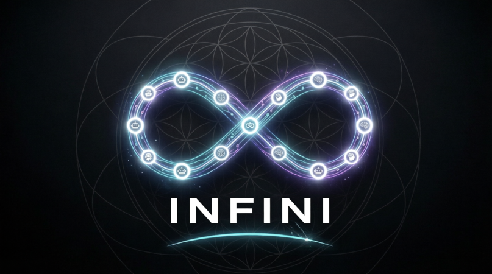

<picture>
  <source media="(prefers-color-scheme: dark)" srcset="assets/logo-dark.png">
  <source media="(prefers-color-scheme: light)" srcset="assets/logo-light.png">
  
</picture>

# INFINI — Portable Agent Loop Spec

**Experimental.** Define a workflow once as a Loopfile. Run it on the reference engine or LangGraph. Compare the resulting traces.

Goal: make agent workflows portable, replayable, and inspectable across runtimes.

[](cli/tests/)
[](tests/conformance/)
[](proof/)
[](LICENSE)

**Status: early alpha.** Reference + LangGraph work in mock mode. Other adapters are planned / help wanted. Do not use in production.

---

## Why

Today, moving an agent workflow between frameworks usually means rewriting orchestration logic. INFINI separates the workflow specification from the runtime so the same Loopfile can execute across supported engines while producing comparable execution traces.

## 60-second install

```bash
pip install infini-cli
```
(Currently install from source while the package stabilizes.)

```bash
git clone https://github.com/NickAiNYC/infini
cd infini
pip install -e './cli[dev]'
infini conformance tests/conformance/ --mock
```

(PyPI package coming once someone confirms the install flow works.)

## One Loopfile

```yaml
LOOPFILE: "1.0"
name: hello-world
OBJECTIVE: "Demonstrate portability across engines."
AGENTS:
  - { name: builder, role: builder, model_tier: sonnet }
STEPS:
  - { id: s1, name: greet, action: write.greeting, uses: builder, produces: [greeting.txt] }
VERIFY:
  syntactic: ["greeting.txt:exists"]
  semantic: []
  confidence_threshold: 80
BUDGET: { dollars: 1, minutes: 5 }
STOP_WHEN: ["all_verify_passed"]
```

Full spec: [loopfile-v1.md](spec/loopfile-v1.md)

## Run on reference engine

```bash
infini run examples/hello-world.yaml --mock
```

## Run on LangGraph

```bash
infini run examples/hello-world.yaml --mock --engine langgraph
```

## Diff the traces

```bash
infini diff runs/latest/run.json runs/latest/run.json
```

Both engines produce `verified` with the same trace schema. Full proof: [PORTABILITY_PROOF.md](docs/PORTABILITY_PROOF.md)

## What's NOT ready

- Live mode (real LLMs). Mock only — I haven't configured API keys for cross-engine testing.
- 4 of 6 adapters (CrewAI, AutoGen, Mastra, OpenAI Agents). CLI accepts `--engine crewai` but the runtime isn't wired — it will error.
- Production use. Zero users. The repo is public for feedback, not deployment.
- Observatory UI exists as a prototype. It currently renders mock data until live trace ingestion is implemented.

## What ships today

| Feature | Status |
|---------|--------|
| Loopfile spec v1.0 | Stable — full JSON Schema + EBNF grammar |
| `infini run --mock` | Deterministic, no API keys needed |
| `infini run --engine langgraph --mock` | LangGraph runtime, identical traces |
| `infini audit .` | Scans project for 12 loop-readiness signals, returns 0-100 score |
| `infini init --pattern daily-triage` | Scaffolds 5 canonical patterns |
| `infini run --work-dir` | Real filesystem verification (stats files, checks content, runs subprocesses) |
| `infini replay --step s2` | Time-travel debug from any step |
| `infini diff` | Compare traces across engines |
| `infini validate` | Validates Loopfiles against schema |
| 25 unit tests + 8 conformance tests | All passing |

## How to contribute

- **Adapters** — Help wire CrewAI, AutoGen, Mastra. Adapter manifests exist; the runtime just needs building.
- **Live mode testing** — If you have API keys, run the same Loopfile on two engines in live mode and post the trace diff.
- **Feedback** — Run `infini audit .` on your project and open an issue telling me if the signals feel wrong.

[Contributing Guide](CONTRIBUTING.md) · [Adapter SDK](sdk/) · [Discussions](https://github.com/NickAiNYC/infini/discussions) · [License: MIT](LICENSE)

---

*MIT licensed reference implementation of the INFINI Loopfile specification. Spec is CC-BY-4.0. Code is MIT.*
