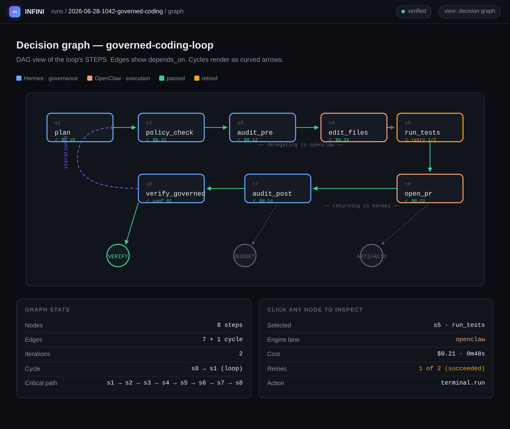
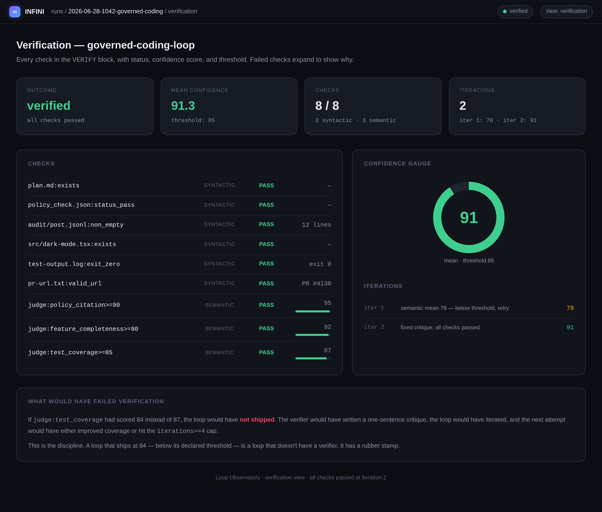
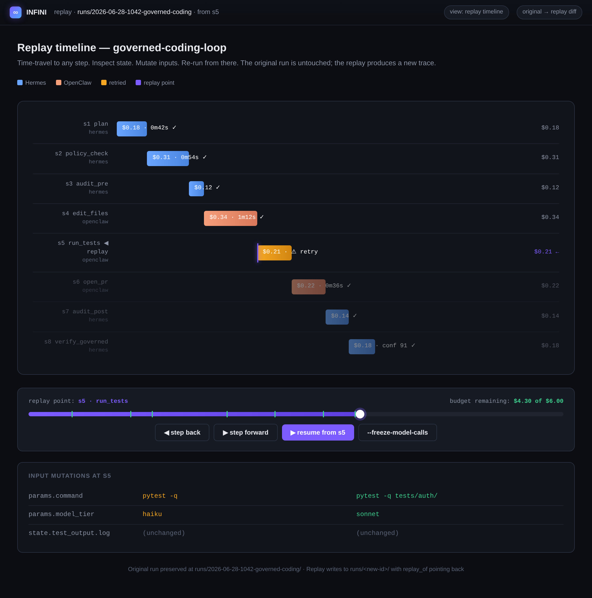
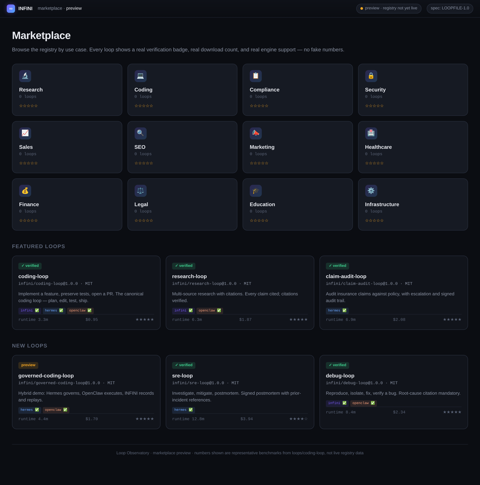

<div align="center">


# INFINI

**Loops that don't end. Loops that improve.**

The open standard for agent loops. Write a `Loopfile`, run it on any engine.

[Spec](spec/loopfile-v1.md) · [RFCs](spec/rfcs/) · [Adapters](adapters/) · [Demos](examples/) · [Handbook](docs/handbook/) · [Manifesto](MANIFESTO.md)

</div>

---

## Vision

INFINI is the **Loopfile standard**. Not a framework. Not a runtime. Not a company. A portable format for autonomous agent loops that any engine can run.

```
Docker      standardized containers.
Terraform   standardized infrastructure.
OpenAPI     standardized APIs.
Markdown    standardized documents.
Git         standardized collaboration.
INFINI      standardizes autonomous work.
```

> **INFINI runs Loopfiles.** Write a Loopfile once. Run it anywhere.

---

## Demo

```yaml
# Loopfile
LOOPFILE: "1.0"
name: dark-mode-toggle
OBJECTIVE: "Add a dark mode toggle, preserve tests"
BUDGET: { dollars: 5, minutes: 15 }
VERIFY:
  syntactic: ["tests:pass", "lint"]
  semantic:  ["rubric:90"]
STOP_WHEN: ["all_verify_passed"]
```

```bash
$ infini run
▶ reading state... none found, starting fresh
▶ executing: plan → code → test → verify
▶ verification: tests PASS · rubric 92/100 PASS
▶ cost: $1.84 / $5.00 · 4m32s / 15m
✓ shipped. state saved. lessons appended.
```

**One file. Any engine. Every loop.**

Run the hybrid demo — Hermes governs, OpenClaw executes, INFINI records:

```bash
infini run examples/hybrid-hermes-openclaw/governed-coding-loop.yaml
infini inspect runs/latest/
```

---

## Architecture

```text
Loopfile
  ↓
INFINI Parser + Validator
  ↓
Engine Adapter   ←─── Hermes (governance)  and/or  OpenClaw (execution)
  ↓
Hermes / OpenClaw Agents
  ↓
Trace + Verification + Replay   (in INFINI)
```

The runtime is replaceable. The Loopfile is portable. INFINI owns the layer between governance systems and agent runtimes — the missing protocol that lets teams separate the loop from the runtime.

---

## Loop Observatory

The signature feature. Every execution leaves behind a visual trace — the **Loop Observatory** is the DevTools for autonomous systems. Eight views: timeline, decision graph, iteration diff, memory snapshots, cost, verification, artifacts, replay.

> **Status: preview.** The Inspector ships in `infini inspect` today. The full Observatory UI is in active development.

<p align="center">
  
</p>

<p align="center">
  
</p>

<p align="center">
  
</p>

<p align="center">
  
</p>

📖 **Spec:** [RFC-0008: Loop Observatory](spec/rfcs/RFC-0008-observatory.md)

---

## INFINI for Hermes and OpenClaw

INFINI is not another agent framework.

- **Hermes** gives teams governed agent operations — policy, memory, escalation, audit trails.
- **OpenClaw** gives agents tools and execution — browser, GitHub, terminal, filesystem.
- **INFINI** gives both a portable loop format — verification, trace, budget, and replay that survive engine swaps.

Write one Loopfile. Run it through Hermes for governance, OpenClaw for execution, or both together.

```text
Loopfile → Hermes policy/memory/governance → OpenClaw execution/tools → INFINI trace/replay/verify
```

This lets teams separate the loop from the runtime. Governance systems and agent runtimes have been hard-coupled because no portable loop format existed between them. INFINI is that format.

### Use Hermes for

policy · memory · escalation · audit trails · business-objective alignment · agent governance

### Use OpenClaw for

tool execution · browser actions · repo edits · terminal commands · agent orchestration · task completion

### Three demos

| Demo | What it shows | Run it |
| --- | --- | --- |
| **Hermes Governance** | Run a claim-audit loop with policy, budget, escalation, and audit trail. | [`examples/hermes-governed-growth/`](examples/hermes-governed-growth/) |
| **OpenClaw Execution** | Run a coding loop that edits files, runs tests, verifies output. | [`examples/openclaw-agent-loop/`](examples/openclaw-agent-loop/) |
| **Hybrid** | Hermes governs. OpenClaw executes. INFINI records and replays. | [`examples/hybrid-hermes-openclaw/`](examples/hybrid-hermes-openclaw/) |

The hybrid demo is the market hook. Run it first.

### Adapters

- [`adapters/hermes/`](adapters/hermes/) — governance brain
- [`adapters/openclaw/`](adapters/openclaw/) — execution runtime
- [`sdk/`](sdk/) — build your own adapter

---

## The Loopfile

```yaml
LOOPFILE: "1.0"
name: my-first-loop
version: 1.0.0

OBJECTIVE: "Say hello in three languages and verify each is correct."

AGENTS:
  - { name: builder, role: builder,  model_tier: haiku }
  - { name: judge,   role: verifier, model_tier: sonnet }

STEPS:
  - { id: s1, name: greet,  action: write_greetings, uses: builder, produces: [greetings.json] }
  - { id: s2, name: verify, action: judge_greetings, uses: judge,   depends_on: [s1] }

VERIFY:
  syntactic: ["greetings.json:valid_json"]
  semantic:  ["judge:correctness>=90"]
  confidence_threshold: 85

BUDGET: { dollars: 1, minutes: 5 }

STOP_WHEN: ["all_verify_passed"]
```

📖 **Spec:** [`spec/loopfile-v1.md`](spec/loopfile-v1.md) · [`spec/grammar.ebnf`](spec/grammar.ebnf) · [`spec/schema.json`](spec/schema.json)

---

## Examples

| Example | Engine | What it shows |
| --- | --- | --- |
| [`hermes-governed-growth/`](examples/hermes-governed-growth/) | Hermes | Governance brain: policy, budget, escalation, audit trail. |
| [`openclaw-agent-loop/`](examples/openclaw-agent-loop/) | OpenClaw | Execution runtime: file edits, tests, PR creation. |
| [`hybrid-hermes-openclaw/`](examples/hybrid-hermes-openclaw/) | Both | The market hook: Hermes governs. OpenClaw executes. INFINI records. |

---

## Marketplace

> **Status: Preview.** A static mock of the future marketplace. The real marketplace ships after the public registry launches.

<p align="center">
  
</p>

Browse the registry by use case: Research, Coding, Compliance, Security, Sales, SEO, Marketing, Healthcare, Finance, Legal, Education, Infrastructure.

Every loop shows a real verification badge, real download count, and real engine support — no fake numbers.

📖 **[`marketplace/`](marketplace/) · [RFC-0006: Marketplace](spec/rfcs/RFC-0006-marketplace.md)**

---

## Registry

`infini publish` pushes your Loopfile to the public registry. `infini install` pulls. Versions are immutable, content-addressed, and signed.

```bash
infini install infini/coding-loop@1.2
infini search "research loop with citations"
infini publish ./Loopfile
```

📖 **[`registry/`](registry/) · [RFC-0005: Registry Protocol](spec/rfcs/RFC-0005-registry.md) · [Metadata Schema](registry/metadata-schema.md)**

---

## Specification

The Loopfile spec is the project's core asset. Everything else exists to serve it.

| File | What it is |
| --- | --- |
| [`spec/loopfile-v1.md`](spec/loopfile-v1.md) | Normative v1.0 spec |
| [`spec/grammar.ebnf`](spec/grammar.ebnf) | Formal grammar |
| [`spec/schema.json`](spec/schema.json) | JSON Schema for validation |
| [`spec/migration.md`](spec/migration.md) | Version-to-version migration |
| [`spec/compatibility.md`](spec/compatibility.md) | Engine support matrix |
| [`spec/rfcs/`](spec/rfcs/) | RFC process + 10 RFCs |

### RFCs

| RFC | Title | Status |
| --- | --- | --- |
| [RFC-0001](spec/rfcs/RFC-0001-loopfile.md) | Loopfile v1.0 | implemented |
| [RFC-0002](spec/rfcs/RFC-0002-verification.md) | Verification Model | implemented |
| [RFC-0003](spec/rfcs/RFC-0003-replay.md) | Replay and Time-Travel | draft |
| [RFC-0004](spec/rfcs/RFC-0004-memory.md) | Loop Memory | draft |
| [RFC-0005](spec/rfcs/RFC-0005-registry.md) | Registry Protocol | draft |
| [RFC-0006](spec/rfcs/RFC-0006-marketplace.md) | Marketplace | draft |
| [RFC-0007](spec/rfcs/RFC-0007-adapter-interface.md) | Adapter Interface | draft |
| [RFC-0008](spec/rfcs/RFC-0008-observatory.md) | Loop Observatory | draft |
| [RFC-0009](spec/rfcs/RFC-0009-provenance.md) | Provenance and Signing | draft |
| [RFC-0010](spec/rfcs/RFC-0010-cost-accounting.md) | Cost Accounting | draft |

📖 **[RFC process](spec/rfcs/README.md)**

### Compatibility Matrix

| Engine | Parse | Run | Verify | Inspect | Replay | Diff |
| --- | :---: | :---: | :---: | :---: | :---: | :---: |
| INFINI Reference | ✅ | ✅ | ✅ | ✅ | ✅ | ✅ |
| Hermes | ✅ | ✅ | ✅ | ✅ | ✅ | 🚧 |
| OpenClaw | ✅ | ✅ | ✅ | ✅ | 🚧 | 🚧 |
| LangGraph | ✅ | 🚧 | 🚧 | 🚧 | 🚧 | 🚧 |
| CrewAI | 🚧 | 🚧 | ❌ | ❌ | ❌ | ❌ |
| AutoGen | 🚧 | 🚧 | 🚧 | 🚧 | ❌ | ❌ |
| OpenAI Agents SDK | 🚧 | 🚧 | 🚧 | 🚧 | ❌ | 🚧 |
| Claude Code | 🚧 | 🚧 | 🚧 | 🚧 | 🚧 | 🚧 |
| Gemini | 🚧 | ❌ | ❌ | ❌ | ❌ | ❌ |

Legend: ✅ shipped · 🚧 adapter in progress · ❌ not yet supported. Updated quarterly.

---

## Adapters

- [`adapters/hermes/`](adapters/hermes/) — governance brain: policy, memory, escalation, audit
- [`adapters/openclaw/`](adapters/openclaw/) — execution runtime: tools, browser, repo, terminal
- [`sdk/`](sdk/) — Adapter SDK: build your own adapter in 6 capabilities

📖 **[Adapter Interface Reference](sdk/adapter-interface.md) · [RFC-0007](spec/rfcs/RFC-0007-adapter-interface.md)**

---

## The 12 Canonical Loops

Curated, versioned, benchmarked. Each ships with a Loopfile, essay, diagram, trace, verification spec, benchmark, and replay guide.

| Loop | What it does |
| --- | --- |
| [`coding-loop`](loops/coding-loop/) | Implement a feature, preserve tests |
| [`refactor-loop`](loops/refactor-loop/) | Refactor a module without behavior change |
| [`test-gen-loop`](loops/test-gen-loop/) | Generate tests until coverage hits target |
| [`debug-loop`](loops/debug-loop/) | Reproduce, isolate, fix, verify a bug |
| [`review-loop`](loops/review-loop/) | Code review with rubric + cross-check |
| [`research-loop`](loops/research-loop/) | Multi-source research with citations |
| [`content-loop`](loops/content-loop/) | Draft → critique → revise content |
| [`outreach-loop`](loops/outreach-loop/) | Personalized outreach at scale |
| [`migration-loop`](loops/migration-loop/) | Migrate code across versions |
| [`doc-sync-loop`](loops/doc-sync-loop/) | Keep docs in sync with code |
| [`oncall-loop`](loops/oncall-loop/) | Triage incidents, propose fixes |
| [`sre-loop`](loops/sre-loop/) | Investigate, mitigate, postmortem |

Install any: `infini install infini/coding-loop@1.0`.

---

## Roadmap

📖 **[Full roadmap](ROADMAP.md)** — organized by theme: Spec, Reference Engine, Adapters, Registry, Discipline, Community.

**Now:** Spec v1.0 final · Hermes + OpenClaw adapters · `infini inspect` + `replay` + `diff` · local registry.

**Next:** Public registry · LangGraph adapter · full Observatory UI · structured memory (v1.1).

**Later:** Spec v2.0 (composition, typed objectives) · cross-engine replay · foundation governance.

---

## Contributing

We accept:

- **Spec changes** (RFCs in `spec/rfcs/`)
- **New canonical loops** (PRs to `loops/`)
- **Engine adapters** (any runtime that can parse Loopfiles — see `sdk/`)
- **Inspector / replay / diff / CLI** (`cli/`)
- **Essays, patterns, anti-patterns, benchmarks** (`docs/`, `benchmarks/`)

Read [`CONTRIBUTING.md`](CONTRIBUTING.md) first. Sign your commits. Be excellent to each other.

### First contribution

| Want to... | Start here |
| --- | --- |
| Create a loop | [`loops/`](loops/) |
| Improve an adapter | [`adapters/`](adapters/) · [`sdk/`](sdk/) |
| Improve the spec | [`spec/rfcs/`](spec/rfcs/) |
| Improve docs | [`docs/handbook/`](docs/handbook/) · [`docs/patterns/`](docs/patterns/) · [`docs/anti-patterns/`](docs/anti-patterns/) |
| Improve the Observatory | [`assets/`](assets/) · [RFC-0008](spec/rfcs/RFC-0008-observatory.md) |
| Improve verification | [RFC-0002](spec/rfcs/RFC-0002-verification.md) · [`docs/handbook/verification.md`](docs/handbook/verification.md) |
| Improve the CLI | [`cli/`](cli/) |

Beginner issues are tagged `good-first-issue` in the issue tracker.

---

## License

- **Spec:** CC-BY-4.0 (`spec/`, `docs/`, `MANIFESTO.md`)
- **Code:** MIT (`cli/`, `ci/`, `adapters/`, `sdk/`)
- **Loops:** MIT (`loops/`, `examples/`)

See [`LICENSE`](LICENSE).

---

## Community

- **Discussions:** GitHub Discussions
- **RFCs:** [`spec/rfcs/`](spec/rfcs/)
- **Office hours:** weekly, see [`docs/community.md`](docs/community.md)
- **Discord:** `https://discord.gg/infini-dev` (coming soon)
- **Security:** [`SECURITY.md`](SECURITY.md)
- **Code of conduct:** [`CODE_OF_CONDUCT.md`](CODE_OF_CONDUCT.md)
- **Funding:** [`.github/FUNDING.yml`](.github/FUNDING.yml)

---

## Status

Spec v1.0 — draft, open for community feedback. The CLI ships with reference implementations of `validate`, `inspect`, `replay`, `diff`, and `ci`. The `run`, `publish`, and `install` commands require an engine adapter (Hermes and OpenClaw adapters ship first; LangGraph adapter follows).

We are shipping first. Join us.

**Loops that don't end. Loops that improve.**
