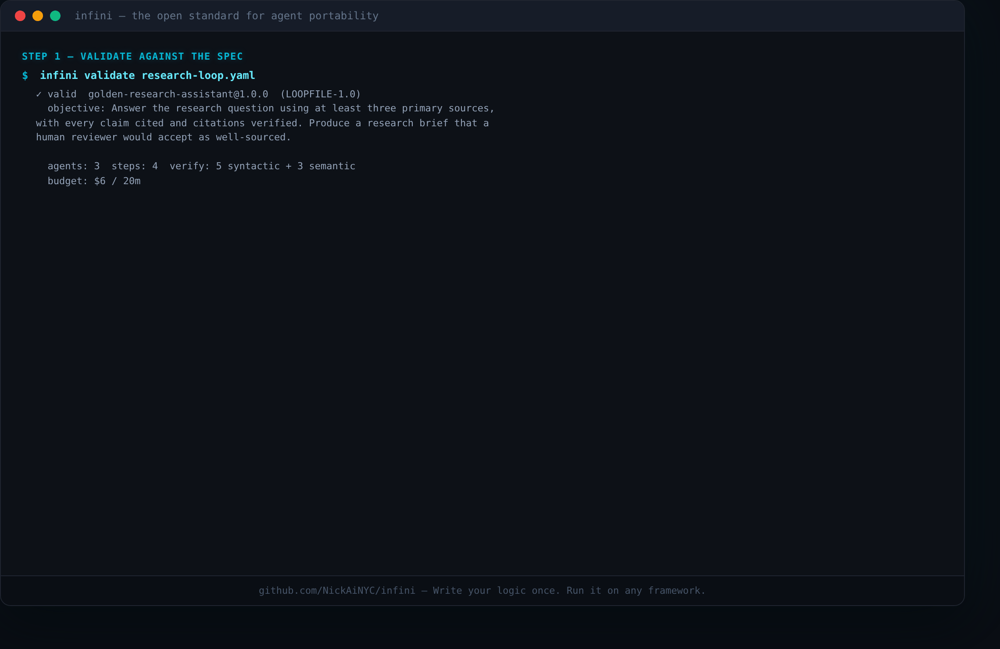
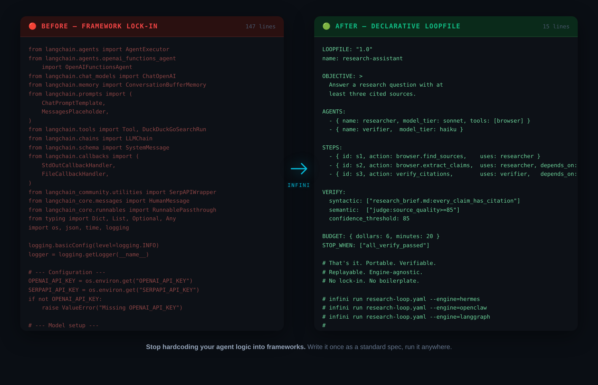
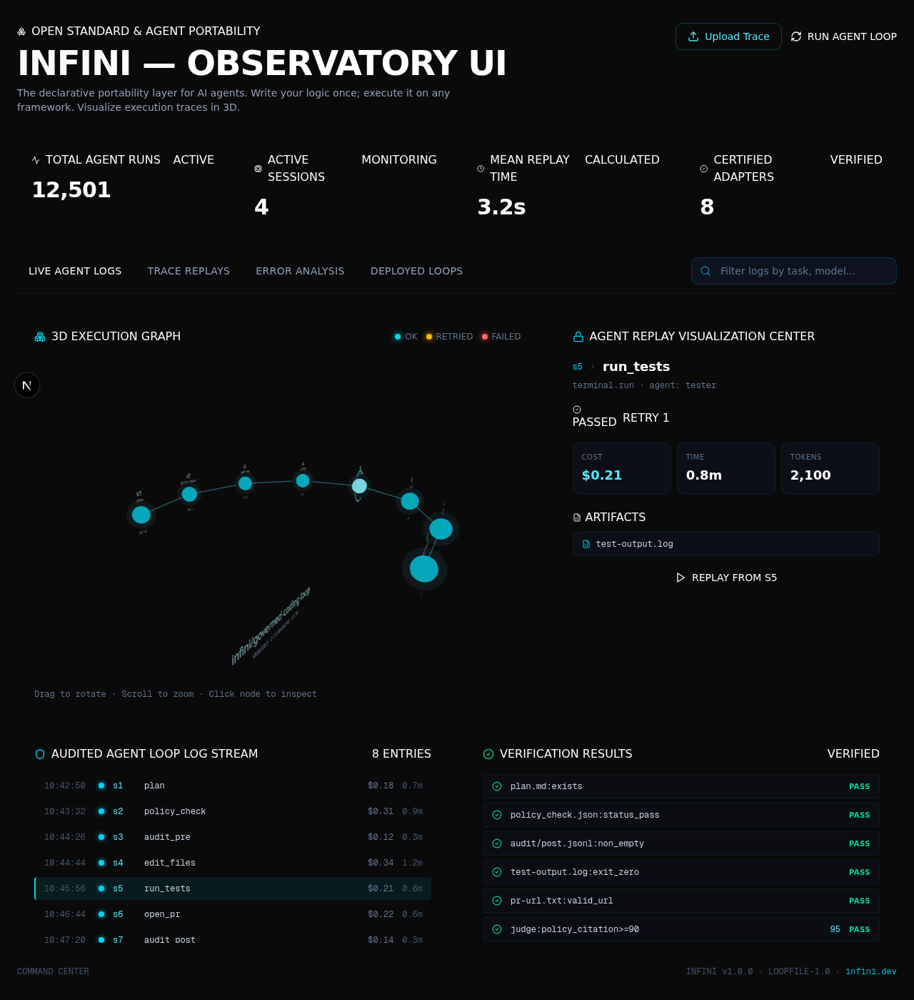

<div align="center">

<picture>
  <source media="(prefers-color-scheme: dark)" srcset="assets/logo-dark.png">
  <source media="(prefers-color-scheme: light)" srcset="assets/logo-light.png">
  
</picture>

# `INFINI`

### The Open Standard for Agent Portability

**Write your agent logic once. Execute it on any framework. <br> Verify it actually worked. Replay it when it didn't.**

<a href="https://opensource.org/licenses/MIT"></a>
<a href="https://www.python.org/"></a>
<a href="spec/loopfile-v1.md"></a>
<a href="tests/conformance/"></a>
<a href="registry/certifications/"></a>
<a href="https://github.com/NickAiNYC/infini"></a>
<a href="#community"></a>

> **Agents just got their Docker moment.**

[Install](#install) · [Quickstart](#quickstart) · [Observatory](#the-observatory) · [Adapters](#adapters) · [Manifesto](MANIFESTO.md) · [Spec](spec/loopfile-v1.md) · [Roadmap](ROADMAP.md)



</div>

---

## The Problem

Current agent frameworks create massive vendor lock-in. Your core logic gets entangled with LangChain, CrewAI, AutoGen, or OpenAI SDKs. Switching runtimes means rewriting everything. Traces are opaque, verification is an afterthought, and migration debt compounds silently.

**INFINI is the escape hatch.**

| The Old Way (Lock-in) | The INFINI Way (Portable) |
| :--- | :--- |
| **Logic** is hardcoded into specific frameworks. | **Logic** is declarative and framework-agnostic. |
| **Execution** is a black box with messy logs. | **Execution** generates standardized, visual traces. |
| **Migration** requires a complete codebase rewrite. | **Migration** requires changing one line in the engine config. |
| **Debugging** involves parsing terminal outputs. | **Debugging** is done via time-travel replay in a 3D UI. |

<div align="center">

### Spaghetti → Spec



<sub>Stop hardcoding your agent logic into frameworks. Write it once as a standard spec, run it anywhere.</sub>

</div>

---

## The Architecture

INFINI standardizes autonomous work through a clean, decoupled architecture:

```text
                    ┌─────────────┐
                    │  Loopfile   │    ← Portable. Declarative. Yours.
                    └──────┬──────┘
                           │
                    ┌──────▼──────┐
                    │   Engine    │    ← Reference, Hermes, OpenClaw, yours
                    └──────┬──────┘
                           │
              ┌────────────┼────────────┐
              │            │            │
        ┌─────▼─────┐ ┌───▼───┐ ┌──────▼──────┐
        │  Adapter  │ │ Trace │ │  Verifier   │
        └─────┬─────┘ └───┬───┘ └──────┬──────┘
              │            │            │
              └────────────┼────────────┘
                           │
                    ┌──────▼──────┐
                    │ Observatory │    ← See everything. Replay anything.
                    └─────────────┘
```

---

## The Loopfile

A declarative `loop.yaml` that defines *what* your agent should do — not *how* one specific framework does it. Same file. Any engine. Full traceability.

```yaml
LOOPFILE: "1.0"
name: research-assistant

AGENTS:
  - { name: researcher, model_tier: sonnet, tools: [browser] }
  - { name: verifier,  model_tier: haiku }

STEPS:
  - { id: s1, action: browser.find_sources, uses: researcher }
  - { id: s2, action: verify_citations, uses: verifier, depends_on: [s1] }

VERIFY:
  syntactic: ["every_claim_has_citation"]
  semantic: ["source_quality >= 85"]
  confidence_threshold: 85

BUDGET: { dollars: 6, minutes: 20 }
STOP_WHEN: ["all_verify_passed"]
```

### Native MCP Support

INFINI ingests any [Model Context Protocol](https://modelcontextprotocol.io) server directly in the YAML. Drop in a standard database, GitHub, or terminal MCP server with one line — no custom integrations, no lock-in.

```yaml
TOOLS:
  - mcp: "github.com/modelcontextprotocol/servers/src/postgres"
  - mcp: "github.com/modelcontextprotocol/servers/src/filesystem"
  - mcp: "github.com/modelcontextprotocol/servers/src/github"
```

📖 **[MCP integration strategy →](docs/mcp-strategy.md)**

---

## Quickstart

### 1. Install

```bash
pip install infini-cli
```

*(Or install from source by cloning this repo and running `pip install -e .` in the `cli/` directory.)*

### 2. Run a Loop

Execute an agent loop end-to-end:

```bash
infini run research-loop.yaml
```

Want to test without API keys? Use Mock Mode for CI & demos:

```bash
infini run examples/golden-research-assistant/research-loop.yaml --mock
```

### 3. Visualize

Every run produces a standardized trace. Launch the local Next.js dashboard to inspect it:

```bash
infini ui runs/latest/run.json
```

```
✓ Loaded Loopfile
✓ Loaded adapter
✓ Executing...
✓ Verification passed
✓ Trace saved
✓ Observatory updated
```

---

## CLI Reference

The `infini` CLI is your control center for portable agents:

```bash
infini init                    # Scaffold a new Loopfile
infini validate loop.yaml      # Check a Loopfile against the spec
infini engines                 # List available adapters
infini run loop.yaml           # Execute a loop
infini run loop.yaml --mock    # Execute with mock adapter (no API key)
infini inspect run.json        # Open trace details in the terminal
infini ui run.json             # Launch the Observatory UI
infini replay run.json         # Time-travel debug a previous run
infini diff v1.yaml v2.yaml    # Semantic diff between Loopfiles
infini conformance tests/conformance/  # Run the conformance suite
infini certify adapters/hermes # Certify an adapter against the spec
infini benchmark loop.yaml     # Run standardized benchmarks
```

---

## The Observatory

Inspectable agents. No more black boxes. The Observatory is a local Next.js + React Three Fiber dashboard that reads your `.trace` files.

<div align="center">
  
</div>

- **3D Execution Graph** — Drop in a `.trace` file for an interactive timeline.
- **Granular Metrics** — See cost, tokens, artifacts, decisions, and failures per step.
- **Time-Travel Debugging** — Replay execution from any node.
- **Diff Analysis** — Compare runs side-by-side with `infini diff`.

---

## Certification

Adapters can be certified against the INFINI spec. Certification runs the
conformance suite and produces a machine-readable report:

```bash
infini certify adapters/hermes --engine infini --mock
infini certify adapters/openclaw --engine infini --mock
```

Produces `registry/certifications/<adapter>.json` + `.md` with:
- Adapter name, version, engine, spec version
- Supported capabilities
- Conformance pass/fail/skip per test
- Compatibility percentage
- Certification status: `experimental` / `compatible` / `certified`

📖 **[Certification reports →](registry/certifications/)** · **[Compatibility matrix →](spec/compatibility.md)**

---

## Canonical Corpus

INFINI's "ImageNet for agent loops" — 10 durable benchmark cases every
engine should run, every release should run.

| # | Case | Category |
| --- | --- | --- |
| 001 | simple-task | minimal, baseline |
| 002 | research-summary | research, verification |
| 003 | code-review | coding, parallel, verification |
| 004 | retry-recovery | resilience, retry |
| 005 | budget-guard | budget, safety |
| 006 | parallel-fanout | parallel, dag |
| 007 | memory-update | memory, learning |
| 008 | tool-call-placeholder | tools, mcp |
| 009 | human-approval-gate | governance, human-in-loop |
| 010 | replay-diff | replay, diff, debugging |

📖 **[Full corpus →](tests/corpus/)**

---

## Adapters

Adapters make the INFINI spec real for runtimes that already exist. The easiest way to contribute to the project is by building a new adapter using the [Adapter SDK](sdk/).

Each adapter must pass the conformance suite: **Parse, Run, Verify, Inspect, Replay**.

| Adapter | Type | Description |
| --- | --- | --- |
| [`hermes/`](adapters/hermes/) | Core | Governance brain: policy, memory, escalation, audit. |
| [`openclaw/`](adapters/openclaw/) | Core | Execution runtime: browser, GitHub, terminal, filesystem. |
| [`crewai/`](adapters/crewai/) | Community | Wrapper for CrewAI framework. *(help wanted)* |
| [`langgraph/`](adapters/langgraph/) | Community | Wrapper for LangChain's LangGraph. *(help wanted)* |
| [`mastra/`](adapters/mastra/) | Community | Wrapper for Mastra integration. *(help wanted)* |
| [`goose/`](adapters/goose/) | Community | Wrapper for Block's Goose. *(help wanted)* |
| [`codex/`](adapters/codex/) | Community | Wrapper for OpenAI's Codex. *(help wanted)* |

---

## The Reference Runtime

> **Current Milestone** — this is what we're building right now.

<div align="center">

```
Loopfile → Engine → Adapter → Execution → Trace → Replay → Observatory
```

</div>

When that path works end-to-end, everything else becomes easy. One demo that shows a Loopfile executing for real communicates the entire value of the project.

| Milestone | Deliverables | Status |
| --- | --- | :---: |
| **1. The Standard Works** | Deterministic engine, schema, conformance (8/8 passing), tests. | ✅ Complete |
| **2. The Standard Travels** | Adapters, certification, compatibility matrix, canonical corpus. | 🔄 In Progress |
| **3. The Standard Scales** | Observatory, registry, signatures, marketplace. | ⏭ Next |
| **4. The Standard Evolves** | MCP, memory, distributed execution, DAG scheduler, parallel workers. | 📋 Planned |

---

## The Lineage

Standards build the future.

```
Docker      standardized   containers
Terraform   standardized   infrastructure
OpenAPI     standardized   APIs
Markdown    standardized   documents
INFINI      standardizes   autonomous work
```

Read our full philosophy in the [Manifesto](MANIFESTO.md).

---

## Community

- [Discussions](https://github.com/NickAiNYC/infini/discussions) — Questions, ideas, show & tell
- [RFCs](spec/rfcs/) — Propose spec changes
- [Contributing](CONTRIBUTING.md) — Learn how to get involved
- [Code of Conduct](CODE_OF_CONDUCT.md) — Contributor Covenant 2.1

---

## Next Steps

- Run a [golden example](examples/) in mock mode
- Read the [12 canonical loops](loops/)
- Explore the [spec](spec/loopfile-v1.md) and [RFCs](spec/rfcs/)
- Build an adapter using the [SDK](sdk/)
- Read the [MCP integration strategy](docs/mcp-strategy.md)
- Read the [Handbook](docs/handbook/)

---

<div align="center">

**Star this repo if you want agents to be portable and inspectable.**

Built for the agent ecosystem. Spec is [CC-BY-4.0](https://creativecommons.org/licenses/by/4.0/). Code is [MIT](LICENSE).

<br>

<sub>Loops that don't end. Loops that improve.</sub>

</div>
