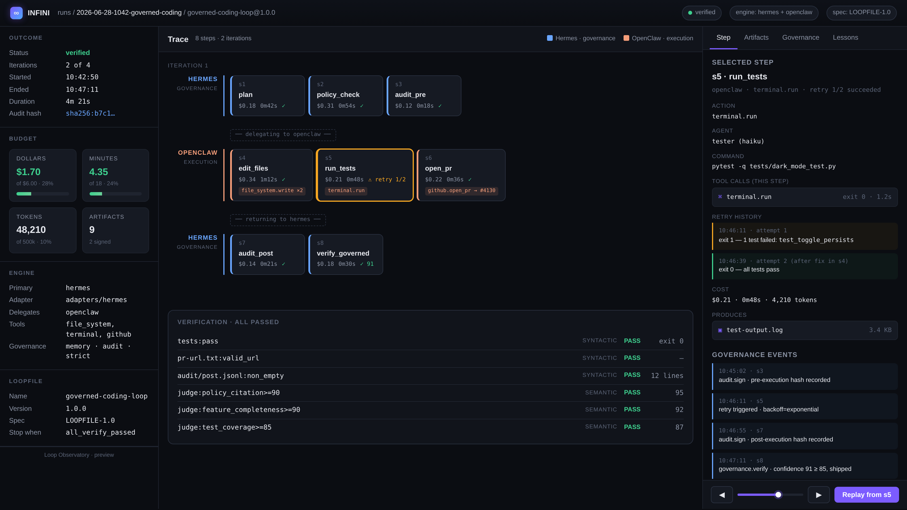

<div align="center">


# INFINI

**Loops that don't end. Loops that improve.**

The open standard for agent loops. Write a `Loopfile`, run it on any engine.

[Spec](spec/loopfile-v1.md) · [Adapters](adapters/) · [Demos](examples/) · [Manifesto](MANIFESTO.md)

</div>

---

## The 30-second pitch

The agent ecosystem has 100 frameworks and zero standards. INFINI fixes that.

```yaml
# Loopfile
LOOPFILE: "1.0"
name: dark-mode-toggle
OBJECTIVE: "Add a dark mode toggle, preserve tests"
BUDGET: { dollars: 5, minutes: 15 }
VERIFY:
  syntactic: ["tests:pass", "lint"]
  semantic:  ["rubric:90"]
STOP_WHEN: ["all_verify_passed"]
```

```bash
$ infini run
▶ reading state... none found, starting fresh
▶ executing: plan → code → test → verify
▶ verification: tests PASS · rubric 92/100 PASS
▶ cost: $1.84 / $5.00 · 4m32s / 15m
✓ shipped. state saved. lessons appended.
```

**One file. Any engine. Every loop.**

> **INFINI runs Loopfiles.**

---

## INFINI for Hermes and OpenClaw

INFINI is not another agent framework.

- **Hermes** gives teams governed agent operations — policy, memory, escalation, audit trails.
- **OpenClaw** gives agents tools and execution — browser, GitHub, terminal, filesystem.
- **INFINI** gives both a portable loop format — verification, trace, budget, and replay that survive engine swaps.

Write one Loopfile. Run it through Hermes for governance, OpenClaw for execution, or both together.

```text
Loopfile
  ↓
INFINI Parser + Validator
  ↓
Engine Adapter   ←─── Hermes (governance)  and/or  OpenClaw (execution)
  ↓
Hermes / OpenClaw Agents
  ↓
Trace + Verification + Replay   (in INFINI)
```

This lets teams separate the loop from the runtime. Governance systems and agent runtimes have been hard-coupled because no portable loop format existed between them. INFINI is that format.

### Three demos

| Demo | What it shows | Run it |
| --- | --- | --- |
| **Hermes Governance** | Run a claim-audit loop with policy, budget, escalation, and audit trail. | [`examples/hermes-governed-growth/`](examples/hermes-governed-growth/) |
| **OpenClaw Execution** | Run a coding loop that edits files, runs tests, verifies output. | [`examples/openclaw-agent-loop/`](examples/openclaw-agent-loop/) |
| **Hybrid** | Hermes governs. OpenClaw executes. INFINI records and replays. | [`examples/hybrid-hermes-openclaw/`](examples/hybrid-hermes-openclaw/) |

The hybrid demo is the market hook. Run it first:

```bash
infini run examples/hybrid-hermes-openclaw/governed-coding-loop.yaml
infini inspect runs/latest/
```

### Adapters

- [`adapters/hermes/`](adapters/hermes/) — governance brain: policy, memory, escalation, audit
- [`adapters/openclaw/`](adapters/openclaw/) — execution runtime: tools, browser, repo, terminal

---

## Why INFINI exists

Every agent framework today — LangGraph, CrewAI, AutoGen, OpenClaw, HermesAgents — reinvents the same five primitives: state, resume, verification, cost ceilings, self-improvement. A loop written for one runtime is useless in another.

Docker didn't win because of Docker Engine. Docker won because of **Dockerfile + Registry + Hub**. The engine got commoditized; the format ate the world.

INFINI is the Loopfile for agent loops. We don't ship a runtime. We ship the format the runtimes agree on — plus a reference engine, an inspector, and a registry.

📖 **Read the [Manifesto](MANIFESTO.md)** — *Loops > Chains*

---

## Why INFINI Wins

```
Docker      standardized containers.
Terraform   standardized infrastructure.
OpenAPI     standardized APIs.
Markdown    standardized documents.
Git         standardized collaboration.
INFINI      standardizes autonomous work.
```

Each line above named a category, then owned it through a portable format that any tool could implement. INFINI does the same for autonomous agent loops: a single `Loopfile` that any engine can parse, run, verify, inspect, replay, and diff.

The bet is simple. Engines will keep multiplying. Models will keep getting cheaper. What won't multiply is the *patience* of teams who want their agent workflows to be reproducible, auditable, and engine-agnostic. Whoever owns the portable format owns the category.

### Who this is for

> **Agent builders who are tired of rewriting the same workflow for every runtime.**

```text
Stop hardcoding agent workflows.

Write a Loopfile once.
Run it with Hermes.
Run it with OpenClaw.
Run it with LangGraph later.
Keep the same verification, trace, budget, and replay model.
```

---

## Install

```bash
# CLI (Python 3.10+)
pip install infini-cli

# With adapter extras
pip install infini-cli[hermes,openclaw]

# Or from source
git clone https://github.com/NickAiNYC/infini
cd infini && pip install -e .
```

---

## Quickstart

### 1. Write a Loopfile

```yaml
# ./Loopfile
LOOPFILE: "1.0"
name: my-first-loop
version: 1.0.0
description: Hello world loop

OBJECTIVE: "Say hello in three languages and verify each is correct."

AGENTS:
  - { name: builder, role: builder,  model_tier: haiku }
  - { name: judge,   role: verifier, model_tier: sonnet }

STEPS:
  - { id: s1, name: greet,  action: write_greetings, uses: builder, produces: [greetings.json] }
  - { id: s2, name: verify, action: judge_greetings, uses: judge,   depends_on: [s1] }

VERIFY:
  syntactic: ["greetings.json:valid_json"]
  semantic:  ["judge:correctness>=90"]
  confidence_threshold: 85

BUDGET: { dollars: 1, minutes: 5 }

STOP_WHEN: ["all_verify_passed"]
```

### 2. Run it

```bash
infini run ./Loopfile
```

### 3. Inspect the run

```bash
infini inspect runs/latest/
```

Opens an interactive trace: every step, every token, every decision, every cost.

### 4. Replay if something went wrong

```bash
infini replay runs/latest/ --step s2
```

Time-travel to any decision point. Inspect state. Change inputs. Re-run from there.

---

## The 12 canonical loops

Curated, versioned, benchmarked. Each ships with a Loopfile + essay + fixtures.

| Loop | What it does |
| --- | --- |
| `coding-loop`     | Implement a feature, preserve tests |
| `refactor-loop`   | Refactor a module without behavior change |
| `test-gen-loop`   | Generate tests until coverage hits target |
| `debug-loop`      | Reproduce, isolate, fix, verify a bug |
| `review-loop`     | Code review with rubric + cross-check |
| `research-loop`   | Multi-source research with citations |
| `content-loop`    | Draft → critique → revise content |
| `outreach-loop`   | Personalized outreach at scale |
| `migration-loop`  | Migrate code across versions |
| `doc-sync-loop`   | Keep docs in sync with code |
| `oncall-loop`     | Triage incidents, propose fixes |
| `sre-loop`        | Investigate, mitigate, postmortem |

Browse them all in [`loops/`](loops/). Install any: `infini install infini/coding-loop@1.0`.

---

## The CLI

```bash
infini run       [Loopfile]   # execute a loop
infini validate  [Loopfile]   # check spec compliance
infini inspect   [run_dir]    # visualize a run trace
infini replay    [run_dir]    # time-travel debug
infini diff      [v1] [v2]    # semantic diff between loop versions
infini install   [loop_ref]   # pull from registry
infini publish   [Loopfile]   # push to registry
infini ci        [Loopfile]   # run loop against fixtures (GitHub Action)
infini engines                # list compatible engines
infini search    [query]      # search the registry
```

---

## The Registry

`infini publish` pushes your Loopfile to the public registry. `infini install` pulls. Versions are immutable and signed.

```bash
infini install infini/coding-loop@1.2
infini search "research loop with citations"
infini publish ./Loopfile
```

Browse: `https://registry.infini.dev` (coming soon — see [`registry/README.md`](registry/README.md))

---

## INFINI CI

Run your loops on every PR. Catch regressions before merge.

```yaml
# .github/workflows/infini-ci.yml
name: INFINI CI
on: [pull_request]

jobs:
  infini:
    runs-on: ubuntu-latest
    steps:
      - uses: actions/checkout@v4
      - uses: infini/ci@v1
        with:
          loopfile: ./loops/coding-loop.yaml
          fixtures: ./tests/fixtures/
          expect:   ./tests/expected/
```

If a PR changes a Loopfile, `infini diff` runs automatically and posts a comment explaining the semantic change.

---

## Loop Observatory

The signature feature. Every execution leaves behind a visual trace — the **Loop Observatory** is the DevTools for autonomous systems.

Open any run and see:

- the graph of decisions taken,
- every verification checkpoint and its verdict,
- total runtime, token count, and dollar cost,
- artifacts produced at each step,
- where the loop failed (if it did), and what was retried,
- what changed between iterations — diffed, annotated, replayable,
- governance events (Hermes) and tool calls (OpenClaw) in the same swimlane view.

> **Status: preview.** The Inspector ships in `infini inspect` today. The full Observatory UI (annotated timeline, cost waterfall, artifact gallery, replay studio, hybrid swimlanes) is in active development. The mockup below shows the target experience.

<p align="center">
  
</p>

If the ecosystem starts associating *loop debugging* with INFINI, that becomes a much stronger moat than any individual runtime. The Observatory is how we get there.

📖 **Spec reference:** [`spec/observability.md`](spec/) (planned)

---

## The Loop Engineer Prompt

INFINI ships with the canonical definition of a new role: **Loop Engineer**. Paste it into any agent runtime and it operates as a Loop Engineer — refusing to ship unverified loops, escalating precisely, improving itself after every run.

📖 **Read it: [`prompts/loop-engineer.md`](prompts/loop-engineer.md)**

This is the "Google SRE Book" move for agents: define the discipline, own the discipline.

---

## Compatibility Matrix

Which engines can parse a Loopfile, run it, verify it, inspect the trace, replay it, and diff versions? Updated quarterly as engine adapters mature.

| Engine                  | Parse Loopfile | Run Loop | Verify | Inspect Trace | Replay | Diff |
| ----------------------- | :------------: | :------: | :----: | :-----------: | :----: | :--: |
| INFINI Reference Engine |       ✅       |    ✅    |   ✅   |      ✅       |   ✅   |  ✅  |
| Hermes                  |       ✅       |    ✅    |   ✅   |      ✅       |   ✅   |  🚧  |
| OpenClaw                |       ✅       |    ✅    |   ✅   |      ✅       |   🚧   |  🚧  |
| LangGraph               |       ✅       |    🚧    |   🚧   |      🚧       |   🚧   |  🚧  |
| CrewAI                  |       🚧       |    🚧    |   ❌   |      ❌       |   ❌   |  ❌  |
| AutoGen                 |       🚧       |    🚧    |   🚧   |      🚧       |   ❌   |  ❌  |
| OpenAI Agents SDK       |       🚧       |    🚧    |   🚧   |      🚧       |   ❌   |  🚧  |
| Claude Code             |       🚧       |    🚧    |   🚧   |      🚧       |   🚧   |  🚧  |
| Gemini                  |       🚧       |    ❌    |   ❌   |      ❌       |   ❌   |  ❌  |

Legend: ✅ shipped · 🚧 adapter in progress · ❌ not yet supported

The INFINI Reference Engine is the canonical implementation. Adapters for other engines live in `adapters/<name>/` and conform to the same Loopfile contract.

📖 **Full matrix and adapter authoring guide:** [`spec/compatibility.md`](spec/compatibility.md)

---

## Repository structure

```
infini/
├── README.md            # you are here
├── MANIFESTO.md         # Loops > Chains
├── CONTRIBUTING.md      # how to contribute
├── CHANGELOG.md         # spec + CLI history
├── LICENSE              # MIT (code), CC-BY-4.0 (spec + docs)
├── assets/              # logo, Observatory mockup, diagrams
├── spec/                # the Loopfile specification
│   ├── loopfile-v1.md   # v1.0 spec, normative
│   ├── grammar.ebnf     # formal grammar
│   ├── schema.json      # JSON Schema for validation
│   ├── migration.md     # version-to-version migration
│   └── compatibility.md # engine support matrix
├── adapters/            # engine adapters
│   ├── hermes/          # governance brain
│   └── openclaw/        # execution runtime
├── examples/            # runnable demos
│   ├── hermes-governed-growth/
│   ├── openclaw-agent-loop/
│   └── hybrid-hermes-openclaw/
├── loops/               # the 12 canonical loops
├── prompts/             # the Loop Engineer prompt
├── registry/            # registry protocol + tooling
├── docs/                # essays, benchmarks, community
├── cli/                 # the infini CLI (reference engine)
└── ci/                  # INFINI CI GitHub Action
```

---

## Contributing

We accept:

- Loopfile spec improvements (RFCs in `spec/`)
- New canonical loops (PRs to `loops/`)
- Engine adapters (any runtime that can parse Loopfiles) — see `adapters/`
- Inspector / replay / diff improvements (`cli/`)
- Essays and benchmarks (`docs/`)

Read [`CONTRIBUTING.md`](CONTRIBUTING.md) first. Sign your commits. Be excellent to each other.

---

## Community

- **Discussions:** GitHub Discussions
- **RFCs:** `spec/` directory
- **Office hours:** weekly, see [`docs/community.md`](docs/community.md)
- **Discord:** `https://discord.gg/infini-dev` (coming soon)

---

## License

- **Spec:** CC-BY-4.0 (`spec/`)
- **Code:** MIT (`cli/`, `ci/`, `adapters/`)
- **Loops:** MIT (`loops/`, `examples/`)
- **Docs:** CC-BY-4.0 (`docs/`, `MANIFESTO.md`)

See [`LICENSE`](LICENSE).

---

## Status

Spec v1.0 — draft, open for community feedback. The CLI ships with reference implementations of `validate`, `inspect`, `replay`, `diff`, and `ci`. The `run`, `publish`, and `install` commands require an engine adapter (Hermes and OpenClaw adapters ship first; LangGraph adapter follows).

We are shipping first. Join us.

**Loops that don't end. Loops that improve.**
