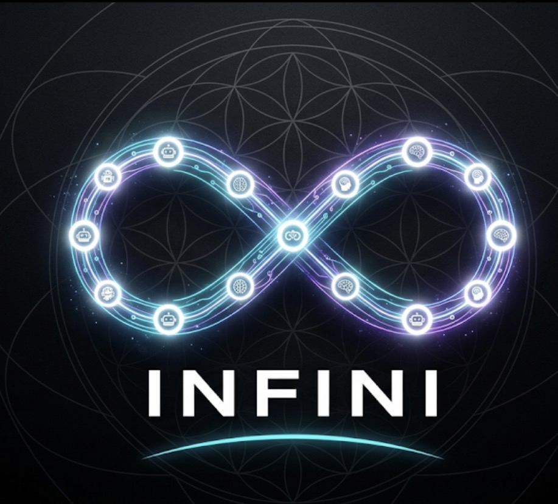

<div align="center">



# INFINI

**The Open Standard for Agent Portability**

The declarative portability layer for AI agents. Write your logic once; execute it on any framework.

[Install](#install) · [Quickstart](#quickstart) · [Observatory](#the-local-observatory) · [Spec](spec/loopfile-v1.md) · [Manifesto](MANIFESTO.md)

</div>

---

## The Architecture of Vendor Lock-In

The current state of AI agent development relies heavily on proprietary orchestration. Engineering teams are forced to couple their core operational logic directly to specific runtimes — LangChain, CrewAI, AutoGen, OpenAI Agents SDK. This creates an immediate and compounding technical debt: **rigid vendor lock-in**.

When an organization needs to transition its infrastructure or adopt a more efficient execution engine, the migration requires a complete architectural rewrite. The business logic becomes deeply entangled with the framework's specific memory handlers, routing mechanisms, and telemetry outputs. Instead of optimizing yield and refining models, engineering bandwidth is consumed by refactoring proprietary execution layers.

Agent behavior should be defined by a universal specification, not dictated by the runtime executing it. We need a standardized, framework-agnostic protocol that separates the logic from the engine.

**INFINI is that protocol.**

---

## The Loopfile Specification

INFINI introduces the **Loopfile** (`loop.yaml`) — a deterministic, declarative standard for defining agent execution. Rather than writing imperative routing logic tied to a single vendor, you declare the sequence of operations: the planners, the tool access, the verification steps, and the retry parameters.

```yaml
LOOPFILE: "1.0"
name: research-loop
OBJECTIVE: "Answer a research question with at least three cited sources."
AGENTS:
  - { name: researcher, role: researcher, model_tier: sonnet, tools: [browser] }
  - { name: verifier,  role: verifier,   model_tier: haiku }
STEPS:
  - { id: s1, name: find_sources,  action: browser.find_sources,  uses: researcher, produces: [sources.json] }
  - { id: s2, name: extract,       action: browser.extract_claims, uses: researcher, depends_on: [s1] }
  - { id: s3, name: verify_cites,  action: browser.verify_citations, uses: verifier, depends_on: [s2] }
VERIFY:
  syntactic: ["research_brief.md:every_claim_has_citation"]
  semantic:  ["judge:source_quality>=85"]
  confidence_threshold: 85
BUDGET: { dollars: 6, minutes: 20 }
STOP_WHEN: ["all_verify_passed"]
```

By abstracting the definition from the execution, the Loopfile allows you to switch underlying runtimes seamlessly:

```bash
infini run loop.yaml --engine=infini      # reference engine
infini run loop.yaml --engine=hermes       # governance brain
infini run loop.yaml --engine=openclaw     # execution runtime
```

Same YAML. Same verification. Same trace. Different engine.

📖 **[Read the spec →](spec/loopfile-v1.md)** · **[Read the RFCs →](spec/rfcs/)**

---

## Install

```bash
pip install infini-cli
```

Or from source:

```bash
git clone https://github.com/NickAiNYC/infini
cd infini/cli && pip install -e .
```

Requires Python 3.10+. The CLI ships with a **mock mode** (`--mock`) so you can run loops without an API key — perfect for evaluation, CI, and demos.

---

## Quickstart

```bash
# 1. Validate a Loopfile
infini validate examples/golden-research-assistant/research-loop.yaml

# 2. Run it (mock mode — no API key needed)
infini run examples/golden-research-assistant/research-loop.yaml --mock

# 3. Inspect the trace
infini inspect runs/latest/

# 4. Replay from a specific step
infini replay runs/latest/ --step s3

# 5. Launch the Observatory UI
infini ui runs/latest/run.json
```

**Time to first loop: under 60 seconds.** No API key, no Docker, no Kubernetes. Just `pip install` and run.

---

## The Local Observatory

Execution is only half the protocol; deterministic visibility is the other. Every INFINI run generates a standardized `.trace` file, capturing exact state changes, memory snapshots, and cost telemetry at every node.

Running `infini ui` provisions a local, Next.js 15-powered dashboard to visualize these execution traces. Designed with a modern AI product aesthetic — deep charcoal backgrounds, atmospheric cyan haze, clean techno-sans-serif typography — the Observatory provides a polished, institutional environment to audit your agent's execution path.

The signature view: a **3D execution graph** built with React Three Fiber. Drop a `.trace` file onto the dashboard and the loop's steps render as an interactive, rotatable node graph. Click any node to see its cost, tokens, artifacts, and replay from that point.

<p align="center">
  
</p>

> **Status: Preview.** The Observatory UI ships in [`observatory-ui/`](observatory-ui/). The 3D graph renders traces produced by `infini run --mock`.

📖 **[Observatory source →](observatory-ui/)** · **[RFC-0008: Loop Observatory →](spec/rfcs/RFC-0008-observatory.md)**

---

## Zero-Downtime Integration

Adopting a new standard must not disrupt active operations. INFINI is engineered for strict parallel integration. It acts as a **read-only overlay** that sits alongside your current infrastructure, allowing you to adopt the standard gradually without risking downtime on your established pipelines.

Drop a `loop.yaml` into your repo. Point it at your existing agent scripts. INFINI orchestrates and traces the execution without disrupting your core operations. You sell your team on visibility and portability first — not a total architectural rewrite.

When you're ready to swap engines, the Loopfile doesn't change. The `ENGINE` block does.

---

## Golden Examples

Two production-grade loops that execute flawlessly across multiple engines using the exact same YAML:

| Example | What it does | Run it |
| --- | --- | --- |
| **Research Assistant** | Multi-source research with citation verification. | [`examples/golden-research-assistant/`](examples/golden-research-assistant/) |
| **SEO Pipeline** | Keyword research → draft → critique → optimize → verify. | [`examples/golden-seo-pipeline/`](examples/golden-seo-pipeline/) |

```bash
# Same YAML, three engines:
infini run examples/golden-research-assistant/research-loop.yaml --engine=infini
infini run examples/golden-research-assistant/research-loop.yaml --engine=hermes
infini run examples/golden-research-assistant/research-loop.yaml --engine=openclaw
```

---

## The CLI

```bash
infini validate  [loopfile]   # check spec compliance
infini run       [loopfile]   # execute a loop (--mock for no API key)
infini inspect   [run_dir]    # inspect a trace in the terminal
infini replay    [run_dir]    # time-travel debug from any step
infini diff      [v1] [v2]    # semantic diff between loops or traces
infini ui        [trace]      # launch the Observatory web app
infini engines                # list compatible engines
infini conformance [dir]      # run the conformance test suite
```

📖 **[CLI source →](cli/)** · **[pyproject.toml →](cli/pyproject.toml)**

---

## Architecture

```text
Loopfile (loop.yaml)
  ↓
INFINI Parser + Validator
  ↓
Engine Adapter   ←─── Hermes (governance)  and/or  OpenClaw (execution)
  ↓
Runtime
  ↓
Trace + Verification + Replay   (in INFINI)
```

INFINI owns the layer between governance systems and agent runtimes — the missing protocol that lets teams separate the loop from the runtime.

### Adapters

- [`adapters/hermes/`](adapters/hermes/) — governance brain: policy, memory, escalation, audit
- [`adapters/openclaw/`](adapters/openclaw/) — execution runtime: tools, browser, repo, terminal
- [`sdk/`](sdk/) — Adapter SDK: build your own adapter in 6 capabilities

---

## Conformance Test Suite

Every adapter must pass the same tests. This is the certification layer.

```bash
infini conformance tests/conformance/ --engine=infini
infini conformance tests/conformance/ --engine=hermes
infini conformance tests/conformance/ --engine=openclaw
```

8 test loops covering: simple execution, retry, verification, cost enforcement, memory, parallelism, research, browser tools.

An adapter that passes all 6 conformance levels earns the **INFINI Certified** badge.

📖 **[Conformance suite →](tests/conformance/)** · **[Compatibility matrix →](spec/compatibility.md)**

---

## The 12 Canonical Loops

Curated, versioned, benchmarked. Each ships with a Loopfile, essay, diagram, trace, verification spec, benchmark, and replay guide.

| Loop | What it does |
| --- | --- |
| [`coding-loop`](loops/coding-loop/) | Implement a feature, preserve tests |
| [`refactor-loop`](loops/refactor-loop/) | Refactor without behavior change |
| [`test-gen-loop`](loops/test-gen-loop/) | Generate tests until coverage target |
| [`debug-loop`](loops/debug-loop/) | Reproduce, isolate, fix, verify |
| [`review-loop`](loops/review-loop/) | Code review with rubric + cross-check |
| [`research-loop`](loops/research-loop/) | Multi-source research with citations |
| [`content-loop`](loops/content-loop/) | Draft → critique → revise |
| [`outreach-loop`](loops/outreach-loop/) | Personalized outreach at scale |
| [`migration-loop`](loops/migration-loop/) | Migrate code across versions |
| [`doc-sync-loop`](loops/doc-sync-loop/) | Keep docs in sync with code |
| [`oncall-loop`](loops/oncall-loop/) | Triage incidents, propose fixes |
| [`sre-loop`](loops/sre-loop/) | Investigate, mitigate, postmortem |

---

## Specification

| File | What it is |
| --- | --- |
| [`spec/loopfile-v1.md`](spec/loopfile-v1.md) | Normative v1.0 spec |
| [`spec/grammar.ebnf`](spec/grammar.ebnf) | Formal grammar |
| [`spec/schema.json`](spec/schema.json) | JSON Schema for validation |
| [`spec/rfcs/`](spec/rfcs/) | RFC process + 10 RFCs |
| [`spec/compatibility.md`](spec/compatibility.md) | Engine support matrix |

### RFCs

| RFC | Title | Status |
| --- | --- | --- |
| [RFC-0001](spec/rfcs/RFC-0001-loopfile.md) | Loopfile v1.0 | implemented |
| [RFC-0002](spec/rfcs/RFC-0002-verification.md) | Verification Model | implemented |
| [RFC-0003](spec/rfcs/RFC-0003-replay.md) | Replay and Time-Travel | draft |
| [RFC-0004](spec/rfcs/RFC-0004-memory.md) | Loop Memory | draft |
| [RFC-0005](spec/rfcs/RFC-0005-registry.md) | Registry Protocol | draft |
| [RFC-0006](spec/rfcs/RFC-0006-marketplace.md) | Marketplace | draft |
| [RFC-0007](spec/rfcs/RFC-0007-adapter-interface.md) | Adapter Interface | draft |
| [RFC-0008](spec/rfcs/RFC-0008-observatory.md) | Loop Observatory | draft |
| [RFC-0009](spec/rfcs/RFC-0009-provenance.md) | Provenance and Signing | draft |
| [RFC-0010](spec/rfcs/RFC-0010-cost-accounting.md) | Cost Accounting | draft |

---

## Repository structure

```
infini/
├── README.md                  # you are here
├── MANIFESTO.md               # Loops > Chains
├── ROADMAP.md                 # themed roadmap
├── CONTRIBUTING.md            # how to contribute
├── CHANGELOG.md               # history
├── LICENSE                    # MIT + CC-BY-4.0
├── SECURITY.md                # disclosure policy
├── CODE_OF_CONDUCT.md
│
├── cli/                       # the infini CLI (working, pip installable)
│   ├── pyproject.toml
│   ├── src/infini/            # parser, engine, trace, mock, inspect, replay, diff, ui
│   └── tests/
│
├── observatory-ui/            # Next.js 15 dashboard with 3D trace visualizer
│   ├── src/app/page.tsx       # the Observatory dashboard
│   └── package.json
│
├── spec/                      # the Loopfile specification
│   ├── loopfile-v1.md         # normative
│   ├── grammar.ebnf           # formal grammar
│   ├── schema.json            # JSON Schema
│   ├── compatibility.md       # engine matrix
│   └── rfcs/                  # 10 RFCs
│
├── adapters/                  # engine adapters
│   ├── hermes/                # governance brain
│   └── openclaw/              # execution runtime
│
├── sdk/                       # Adapter SDK
├── tests/conformance/         # 8 conformance test loops
├── examples/                  # 5 demos including 2 golden examples
├── loops/                     # 12 canonical loops
├── patterns/                  # 13 design patterns
├── anti-patterns/             # 9 anti-patterns
├── benchmarks/                # 5 benchmark specs
├── marketplace/               # 12 category pages (preview)
├── docs/handbook/             # 10-chapter Loop Engineer handbook
├── prompts/                   # the Loop Engineer prompt
├── registry/                  # registry protocol + metadata schema
└── assets/                    # logo, Observatory screenshots, mockups
```

---

## Roadmap

📖 **[Full roadmap →](ROADMAP.md)**

**Now (V1 — shipped):** Working CLI (`infini validate/run/inspect/replay/diff/ui`) · Mock mode (no API key) · Observatory UI with 3D trace graph · Loopfile spec v1.0 · 10 RFCs · Adapter SDK · Hermes + OpenClaw adapters · Conformance suite · 2 Golden Examples.

**Next:** Public registry · LangGraph adapter · Live execution mode · structured memory (v1.1).

**Later:** Spec v2.0 (composition, typed objectives) · cross-engine replay · foundation governance.

---

## Contributing

We accept spec changes (RFCs), new canonical loops, engine adapters, CLI/Inspector improvements, and essays/benchmarks. Read [`CONTRIBUTING.md`](CONTRIBUTING.md) first. Sign your commits.

Beginner issues are tagged `good-first-issue`.

---

## License

- **Spec:** CC-BY-4.0 (`spec/`, `docs/`, `MANIFESTO.md`)
- **Code:** MIT (`cli/`, `ci/`, `adapters/`, `sdk/`, `observatory-ui/`)
- **Loops:** MIT (`loops/`, `examples/`)

See [`LICENSE`](LICENSE).

---

## Community

- **Discussions:** GitHub Discussions
- **RFCs:** [`spec/rfcs/`](spec/rfcs/)
- **Security:** [`SECURITY.md`](SECURITY.md)
- **Code of conduct:** [`CODE_OF_CONDUCT.md`](CODE_OF_CONDUCT.md)

---

## Status

V1 shipped. The CLI works end-to-end in mock mode. The Observatory UI renders traces in 3D. The spec is open for community feedback.

You aren't being asked to use our software. You're being invited to govern a new standard.

**Write your logic once. Execute it on any framework.**
